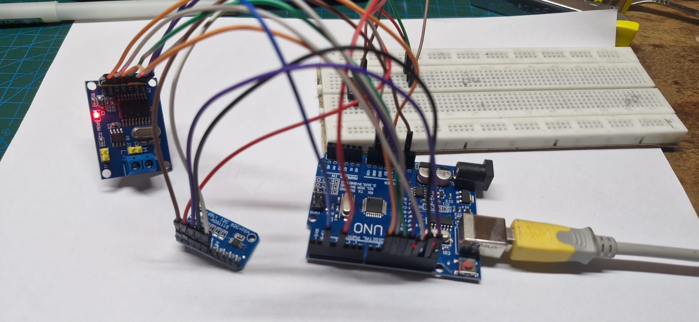
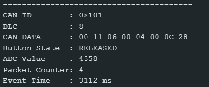
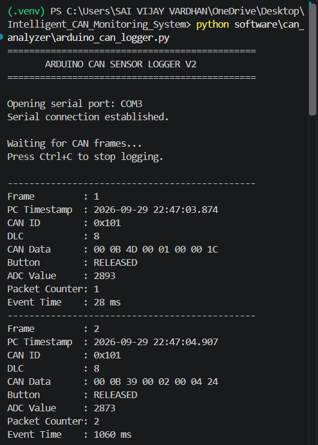
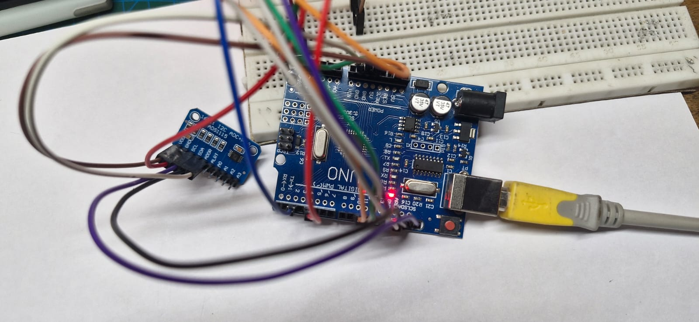
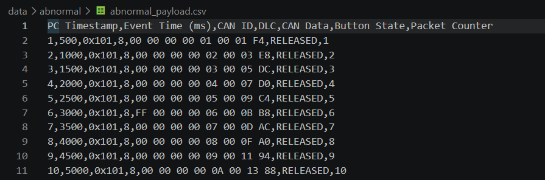
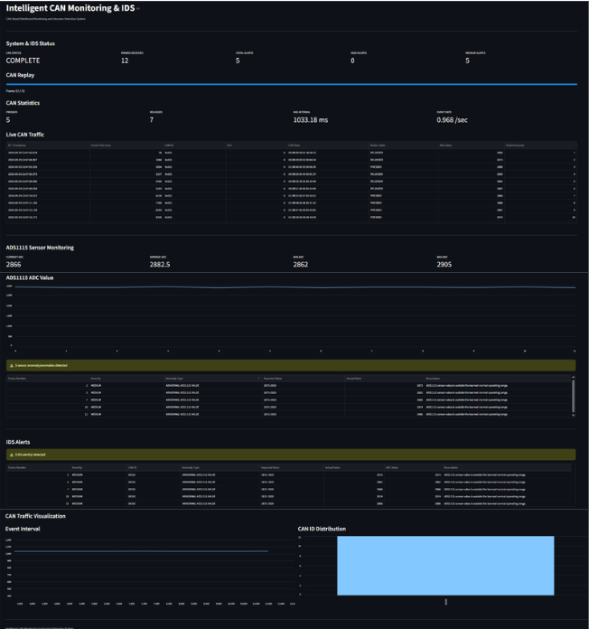

# Intelligent CAN-Based Monitoring and Intrusion Detection System

> An end-to-end CAN monitoring and intrusion detection platform for analyzing vehicle-network traffic, monitoring sensor data, detecting abnormal behavior, generating security alerts, and visualizing system activity through an interactive dashboard.

---

## Overview

Modern vehicles rely heavily on the Controller Area Network (CAN) to exchange information between electronic control units (ECUs). While CAN is efficient and widely deployed, the protocol does not inherently provide mechanisms for authentication or intrusion detection.

This project implements an intelligent monitoring and intrusion detection workflow that combines:

- CAN communication
- ADS1115 sensor acquisition
- Arduino-based embedded hardware
- MCP2515 CAN controller
- TJA1050 CAN transceiver
- Python-based CAN logging and analysis
- Rule-based anomaly detection
- Sensor baseline analysis
- Structured IDS alert generation
- Streamlit-based visualization

The system establishes a normal operating baseline and compares incoming CAN frames and sensor values against that baseline to identify abnormal behavior.

---

## System Architecture

```text
                     ┌───────────────┐
                     │    ADS1115    │
                     │  Sensor / ADC │
                     └───────┬───────┘
                             │ I²C
                             ▼
                     ┌───────────────┐
                     │  Arduino Uno  │
                     └───────┬───────┘
                             │ SPI
                             ▼
                     ┌───────────────┐
                     │    MCP2515    │
                     │ CAN Controller│
                     └───────┬───────┘
                             │
                             ▼
                     ┌───────────────┐
                     │    TJA1050    │
                     │ CAN Transceiver│
                     └───────┬───────┘
                             │
                             ▼
                         CAN Bus
                             │
                             ▼
                       USB Serial
                             │
                             ▼
                     ┌───────────────┐
                     │    Python     │
                     │ Logger + IDS  │
                     └───────┬───────┘
                             │
              ┌──────────────┼──────────────┐
              ▼              ▼              ▼
          CAN Logging    Anomaly IDS    Data Analysis
              │              │              │
              └──────────────┼──────────────┘
                             ▼
                     ┌───────────────┐
                     │   Streamlit   │
                     │   Dashboard   │
                     └───────────────┘
```

---

## Hardware Used

| Component | Purpose |
|---|---|
| Arduino Uno | Embedded CAN node and sensor interface |
| ADS1115 | 16-bit ADC for sensor data acquisition |
| MCP2515 | CAN controller |
| TJA1050 | CAN physical-layer transceiver |
| Push Button | Digital event input |
| CAN Bus Interface | CAN communication |
| USB Cable | Arduino-to-PC serial communication |

---

## Software & Technologies

### Programming

- C/C++ — Arduino firmware
- Python — logging, analysis, IDS, dashboard

### Python Libraries

- `python-can`
- `pandas`
- `numpy`
- `matplotlib`
- `streamlit`

### Communication

- CAN
- SPI
- I²C
- USB Serial

### Development & Version Control

- Arduino IDE
- Git
- GitHub

---

## CAN Data Protocol

The system uses CAN ID `0x101` with an 8-byte data payload.

| Byte | Field | Description |
|---|---|---|
| Byte 0 | Button State | `00` = Released, `01` = Pressed |
| Bytes 1–2 | ADC Value | 16-bit ADS1115 reading |
| Bytes 3–4 | Packet Counter | 16-bit sequential frame counter |
| Bytes 5–7 | Event Time | 24-bit event timestamp in milliseconds |
---

### Payload Structure

```text
Byte 0       → Button State
Bytes 1–2    → ADS1115 ADC Value
Bytes 3–4    → Packet Counter
Bytes 5–7    → Event Time
```

### Example CAN Payload

```text
00 0B 5A 00 29 00 A1 90
```

Decoded:

```text
Button State  = 0
ADC Value     = 2906
Packet Counter = 41
Event Time    = 41360 ms
```

---

## CAN Data Logging

CAN communication is captured through the Arduino and transferred to Python through USB serial communication.

The logger records:

- PC timestamp
- Event time
- CAN ID
- DLC
- CAN data
- Button state
- ADC value
- Packet counter

The collected data is stored in CSV format and forms the basis for subsequent traffic analysis and anomaly detection.

---

## Normal CAN Baseline

A normal CAN traffic baseline is created from the recorded dataset.

The baseline defines expected communication characteristics, including:

- Expected CAN ID
- Allowed DLC
- Expected data length
- Valid button states
- Packet counter progression
- Event timing

For the recorded normal dataset:

```text
Expected CAN ID      : 0x101
Expected DLC         : 8
Expected Data Length: 8
Expected Packet Step : 1
CAN Sessions         : 1
```

---

## ADS1115 Sensor Baseline

The ADS1115 readings were analyzed to establish a normal sensor operating range.

### Baseline Statistics

| Parameter | Value |
|---|---:|
| Total frames | 51 |
| Minimum | 2843 |
| Maximum | 8126 |
| Median | 2896 |
| Q1 | 2887.50 |
| Q3 | 2908.00 |
| IQR | 20.50 |
| Normal minimum | 2875 |
| Normal maximum | 2920 |
| Mean of normal range data | 2897.59 |

Two possible outliers were identified during baseline analysis:

```text
Frame 40 → ADC = 2843
Frame 41 → ADC = 8126
```

The IDS uses the established normal range of:

```text
2875 – 2920
```

---

## Intrusion Detection System

The unified CAN IDS evaluates each received frame against the established CAN and sensor baselines.

### Detection Checks

| Detection | Description |
|---|---|
| CAN ID anomaly | Detects unexpected CAN identifiers |
| DLC anomaly | Detects unexpected CAN data length codes |
| Data length anomaly | Checks actual payload length |
| Payload anomaly | Detects invalid or unexpected payload values |
| Sequence anomaly | Detects missing or unexpected packet counters |
| Rate anomaly | Detects abnormal traffic frequency |
| Sensor anomaly | Detects ADS1115 values outside the normal range |

The IDS also tracks CAN sessions by monitoring event-time progression.

---

## Controlled Anomaly Tests

Controlled abnormal datasets were generated to evaluate individual IDS detection mechanisms.

The tested anomaly categories include:

- Abnormal CAN ID
- Abnormal DLC
- Abnormal traffic rate
- Packet sequence anomaly
- Abnormal payload

These datasets provide controlled test cases for validating the behavior of the IDS.

---

## IDS Alert Logger

The IDS Alert Logger converts detected anomalies into structured security alerts.

Each alert contains information such as:

- Alert timestamp
- Session
- Severity
- Frame number
- CAN ID
- DLC
- Data length
- CAN data
- Anomaly type
- Expected value
- Actual value
- Description
- Packet counter
- Event time
- ADC value
- Alert status

Sensor anomalies are assigned **MEDIUM** severity in the current implementation.

---

## Dataset Results

The final recorded CAN dataset contains:

```text
Total frames       : 51
CAN ID             : 0x101
DLC                : 8
Packet counters    : 1–51
CAN sessions       : 1
Total anomalies    : 2
```

### Detected Anomalies

| Frame | Anomaly | Expected | Actual |
|---:|---|---|---:|
| 40 | Abnormal ADS1115 value | 2875–2920 | 2843 |
| 41 | Abnormal ADS1115 value | 2875–2920 | 8126 |

### Unified IDS Summary

```text
CAN ID anomalies       : 0
DLC anomalies          : 0
Data length anomalies  : 0
Payload anomalies      : 0
Sequence anomalies     : 0
Rate anomalies         : 0
Sensor anomalies       : 2
```

### Result

```text
CAN/SENSOR ANOMALIES DETECTED
```

The IDS successfully identified the two abnormal ADS1115 values while no anomalies were detected in CAN ID, DLC, data length, payload, packet sequence, or traffic rate for the final dataset.

---

## Streamlit Dashboard

A Streamlit dashboard was developed to provide an interactive interface for monitoring CAN traffic and IDS alerts.

### Dashboard Features

- CAN communication status
- Frame count
- Total alert count
- High and medium severity alerts
- Button state statistics
- CAN ID information
- DLC information
- Packet counter monitoring
- ADS1115 sensor monitoring
- Normal sensor range
- ADC trend visualization
- IDS alert table
- CAN event interval visualization
- CAN ID distribution
- CAN traffic replay

### Final Dataset Dashboard

The final dashboard displays:

```text
CAN Frames        : 51 / 51
Total Alerts      : 2
High Alerts       : 0
Medium Alerts     : 2
Pressed Frames    : 9
Released Frames   : 42
CAN ID            : 0x101
DLC               : 8
Packet Counter    : 1 → 51
ADC Normal Range  : 2875 – 2920
ADC Minimum       : 2843
ADC Maximum       : 8126
```

---

## Key Features

- Real-time CAN monitoring
- CAN data logging
- ADS1115 sensor acquisition
- CAN traffic baseline creation
- Sensor baseline creation
- CAN ID anomaly detection
- DLC anomaly detection
- Payload anomaly detection
- Packet sequence monitoring
- Traffic-rate monitoring
- Sensor anomaly detection
- Controlled anomaly generation
- Structured IDS alert generation
- CAN traffic visualization
- Interactive Streamlit dashboard
- Git-based version control
- GitHub project management

---

## Project Workflow

```text
CAN Data Acquisition
        ↓
CAN Data Logging
        ↓
Normal Baseline Creation
        ↓
Sensor Baseline Creation
        ↓
CAN Traffic Analysis
        ↓
Anomaly Detection
        ↓
IDS Alert Generation
        ↓
Dashboard Visualization
```

---

## Project Outcome

This project demonstrates an end-to-end CAN monitoring and intrusion detection workflow combining embedded systems, automotive communication, sensor monitoring, data analysis, and cybersecurity concepts.

The final system analyzed a **51-frame CAN dataset** and successfully detected **2 abnormal ADS1115 sensor values**.

The project demonstrates how baseline-based monitoring can be used to identify abnormal behavior in a CAN communication environment.

---

## Technologies

**Embedded Systems**

Arduino Uno • ADS1115 • MCP2515 • TJA1050

**Communication**

CAN • SPI • I²C • USB Serial

**Programming**

C/C++ • Python

**Data Analysis**

Pandas • NumPy • Matplotlib

**Monitoring**

Streamlit

**Version Control**

Git • GitHub

---

## Author

**D.V. Sai Vijay Vardhan**

B.Tech Electronics & Communication Engineering  
Mahindra University, Hyderabad

---
